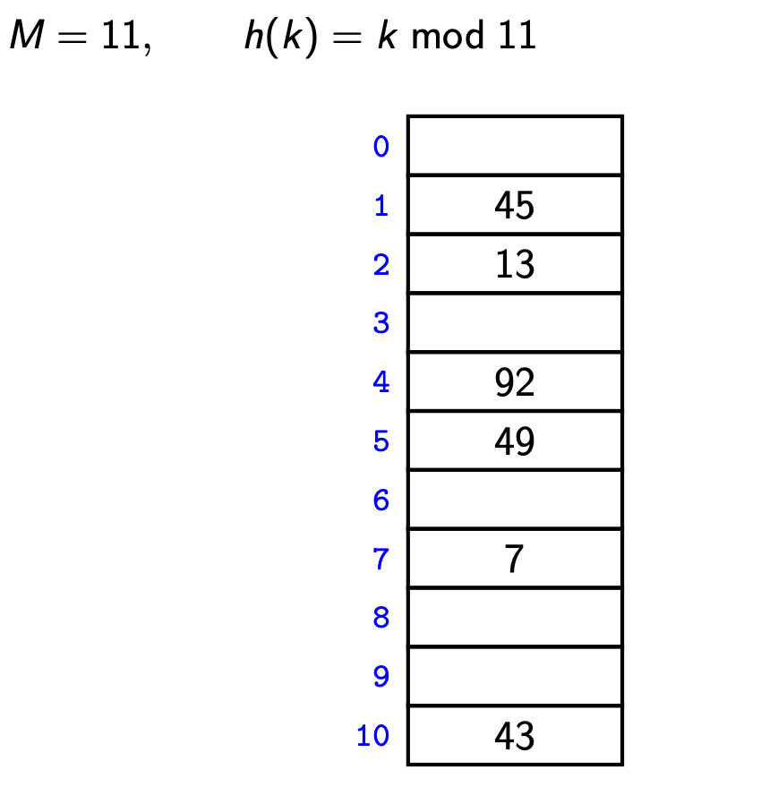

# Dictionary

A dictionary is a collection of items, each of which contains
* a key
* some data

and is called a key-value pair (KVP). Keys can be compared and are (typically) unique.

Operations:
- Search
- Insert
- Delete

# Array
## Unordered array 
**Complexity of Unordered array :**
- Search:  O(n)
- Insert: O(1)
- Delete: O(n)

## Ordered array
**Complexity of Ordered array :**
- Search:  O(log n)
- Insert: O(n)
- Delete: O(n)

# linked List


**Example of linked List in python**

```python
class Node:
    def __init__(self, key=None, data = None):
      self.key = key
      self.data = data
      self.next_node = None

node_1 = Node(1, "Monday")
node_2 = Node(2, "Tuesday")
node_3 = Node(3, "Wednesday")

node_2.next_node = node_3
node_1.next_node = node_2


cur_node = node_1
while (cur_node):
    data = cur_node.data
    print(data)
    cur_node = cur_node.next_node
```

**Complexity of Linked list:**
- Search:  O(n)
- Insert: O(1)
- Delete: O(n)


# Binary Search Tree
A BST is either empty or contains a KVP, left child BST, and right child BST.

Every key k in T.left is less than the root key.

Every key k in T.right is greater than the root key.


## BST Delete
- If node is a leaf, just delete it.
- If node has one child, move child up
- Else put the right node's leftest leaf up.

**Complexity of Binary Search Tree:**
- searching
- insert
- delete

# Hashing

## Chaining

***Example:***



**Complexity of chaining:**
- searching
- insert
- delete

## Linear Probing

**Complexity of Linear Probing:**
- searching
- insert
- delete


## Double Hashing

**Complexity of Double Hashing:**
- searching
- insert
- delete


