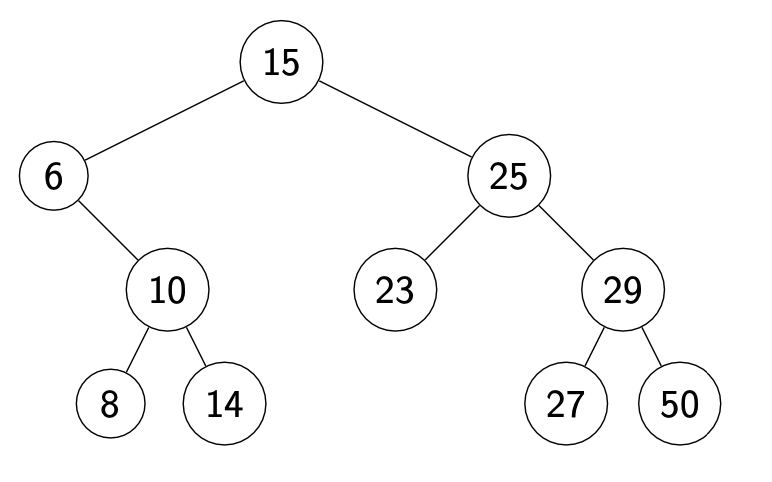

# Dictionary

A dictionary is a collection of items, each of which contains
* a key
* some data

and is called a key-value pair (KVP). Keys can be compared and are (typically) unique.

Operations:
- Search
- Insert
- Delete

# Array
## Unordered array 
**Complexity of Unordered array :**
- Search:  O(n)
- Insert: O(1)
- Delete: O(n)

## Ordered array
**Complexity of Ordered array :**
- Search:  O(log n)
- Insert: O(n)
- Delete: O(n)

# linked List


**Example of linked List in python**

```python
class Node:
    def __init__(self, key=None, data = None):
      self.key = key
      self.data = data
      self.next_node = None

node_1 = Node(1, "Monday")
node_2 = Node(2, "Tuesday")
node_3 = Node(3, "Wednesday")

node_2.next_node = node_3
node_1.next_node = node_2


cur_node = node_1
while (cur_node):
    data = cur_node.data
    print(data)
    cur_node = cur_node.next_node
```

**Complexity of Linked list:**
- Search:  O(n)
- Insert: O(1)
- Delete: O(n)


# Binary Search Tree
A BST is either empty or contains a KVP, left child BST, and right child BST.

Every key k in T.left is less than the root key.

Every key k in T.right is greater than the root key.



## BST Delete
- If node is a leaf, just delete it.
- If node has one child, move child up
- Else put the right node's leftest leaf up.

**Complexity of Binary Search Tree:**
- searching
- insert
- delete

# Hashing

## Chaining

***Example:***


**Complexity of chaining:**
- searching
- insert
- delete

## Linear Probing

**Complexity of Linear Probing:**
- searching
- insert
- delete


## Double Hashing

**Complexity of Double Hashing:**
- searching
- insert
- delete


# Heap


A tree is heap-ordered if the key in each node is larger than or equal to the keys in all of that node's children (if any). Equivalently, the key in each node of a heap-ordered tree is smaller than or equal to the key in that node's parent (if any)

## Insertion in Heap

- Place the new key at the first free leaf
- The heap-order property might be violated: perform a bubble-up:
- The new item bubbles up until it reaches its correct place in the heap.

```python
def bubble-up(v):
v: a node of the heap

while parent(v) exists and key(parent(v)) < key(v) do
    swap v and parent(v)
    v = parent(v)
```

Time:
O(height of heap) = O($\log n$).

## Delete Max in heap

- The maximum item of a heap is just the root node.
- We replace root by the last leaf
- The heap-order property might be violated: perform a bubble-down:
  
```python
def bubble-down(v):
v: a node of the heap

while v is not a leaf do
    u <- child of v with largest key
    if key(u) > key(v) then
        swap v and u
        v←u 
    else
        break
```
Time: O(height of heap) = O (log n).

## Building Heap

Problem statement: Given n items (in A[0 · · · n − 1]) build a heap containing all of them.

### Sample Solution
 Start with an empty heap and insert items one at a time:

 ```python
heapify1(A)
A: an array
initialize H as an empty heap
for i = 0 to size(A) − 1 do
    heapInsert (H , A[i ])
 ```

 Time: O($n \log n$)

 ### Solution 2
Using bubble-downs instead:
 ```python
heapify (A) 
A: an array
n ← size(A) − 1
for i ← ⌊n/2⌋ downto 0 do
    bubble−down(A,i)
 ```

## Using a Priority Queue to Sort

```python
def HeapSort (A):
heapify (A)
for i ← 0 to n − 1 do
    A[n − 1 − i] ← heapDeleteMax(H)
```

Running time of HeapSort: O(n log n)

