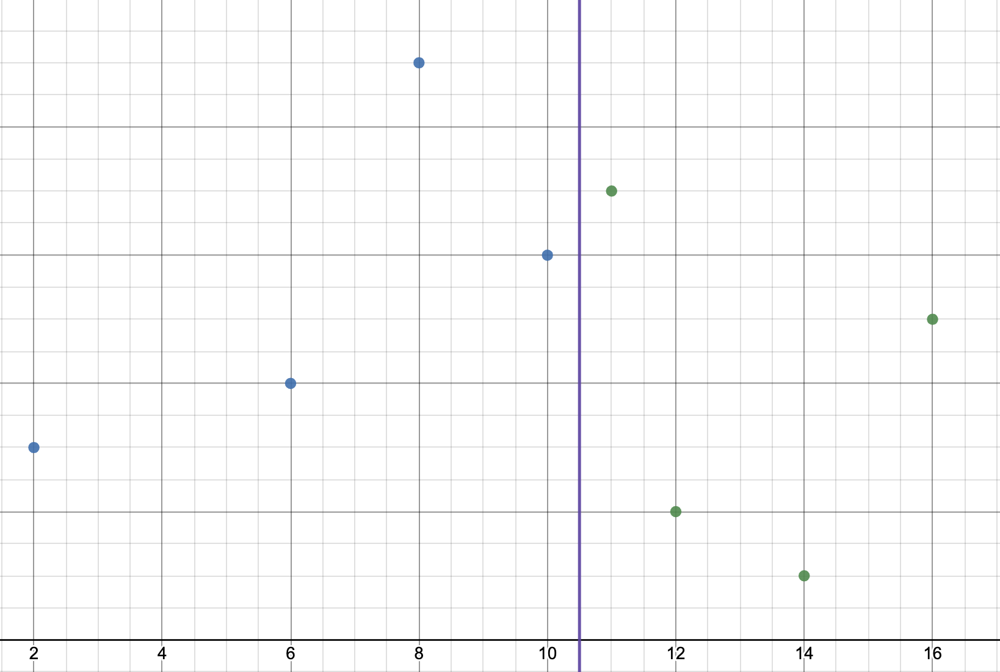
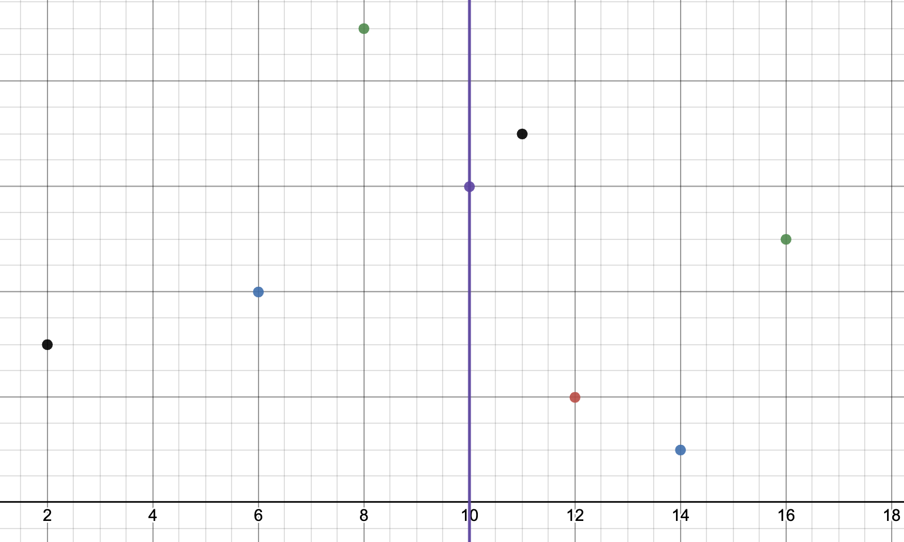

# Divide and Counter

# Merge Sort

**Divide:** 

Split A into two subarrays: 

$A_L$ consists of the first $\lceil n_2 \rceil$ elements in A and $A_R$ consists of the last $\lfloor n_1 \rfloor$ elements in A.

**Conquer**: 

After $A_L$ and $A_R$ have been sorted, use a function Merge to merge $A_L$ and $A_R$ into a single sorted array.

We simply keep track of the “current” element of $A_L$ and $A_R$, always copying the smaller one into the sorted arra


```python
def merge(L1,L2,L):
    pos1,pos2,posL = 0,0,0
    while (pos1 < len(L1)) and (pos2 < len(L2)):
        if L1[pos1] < L2[pos2]: 
            L[posL] = L1[pos1] 
            pos1 += 1
        else:
            L[posL] = L2[pos2] 
            pos2 += 1
    posL += 1
    while (pos1 < len(L1)):
        L[posL] = L1[pos1]
        pos1, posL = pos1+1, posL+1
    while (pos2 < len(L2)):
        L[posL] = L2[pos2]
        pos2, posL = pos2+1, posL+1
    
def mergesort(L):
    if len(L) < 2: return mid = len(L)//2
    L1 = L[:mid]
    L2 = L[mid:] 
    mergesort(L1) 
    mergesort(L2) 
    merge(L1,L2,L)
```
# How fast can we find the Max?

 The CLS (Circular Left Shift) shifts all entries 1 position to the left with the first element moved to the last entry.

```Python
def CLS(lst):
    last_item = lst.pop()
    return last_item + lst[:-1]
```

Given a sorted in descending order array X[1 ... n] of distinct integers, the CLS operation was applied to it several times. How can we find the maximum item in such array?

Here are examples of some array applied CLS several times:
```
[5, 6, 1, 2, 3, 4]
[6, 1, 2, 3, 4, 5]
[1, 2, 3, 4, 5, 6]
```

**Divide:** 

**Conquer:** 


# Tower dominates

Consider the following problem. There are $n$ towers defined by their integer coordinates $x_i$ and $y_i$; $i = 1, 2, ...,n$. We say that a tower $i$ dominates a tower $j$ if

$$
(x_i > x_j) \land (y_i > y_j) \vee (x_i < x_j) \land (y_i < y_j).
$$


The the dominance factor of tower $i$ as the total number of towers dominated by it. We would like to compute the dominance factor of each tower. A straightforward algorithm for this problem is to check the dominance condition for every pair of towers and has complexity $O(n^2)$.

***Example***

Suppose we have following points:

$$
(2, 3), (6, 4), (8, 9), (10, 6), (11, 7), (12, 2), (14, 1), (16, 5)
$$

First we sort them by y-coordinate, then we get:

$$
(14, 1), (12, 2), (2, 3), (6, 4), (16, 5), (10, 6), (11, 7), (8, 9)
$$

Then we split the list in to left and right part by median of x,




$$
L_l = (2, 3), (6, 4), (10, 6), (8, 9)
$$

$$
L_r = (14, 1), (12, 2), (16, 5), (11, 7)
$$


# Closest Pair

Suppose we pre-sort the points in Q with respect to their x-coordinates.
Then we can easily find the vertical line that partitions the set of points Q into two sets of size n/2.




**Divide:** 

We have two subproblems, consisting of the first n/2 points and the last n/2 points.

**Conquer**: 

Given that we have determined the shortest distance among the first n/2 points and the shortest distance among the last n/2 points, what additional work is required to determine the overall shortest distance?

Suppose we have eight points, ordered by x-co-ordinates:

$$
(2, 3), (6, 4), (8, 9), (10, 6), (11, 7), (12, 2), (14, 1), (16, 5)
$$
