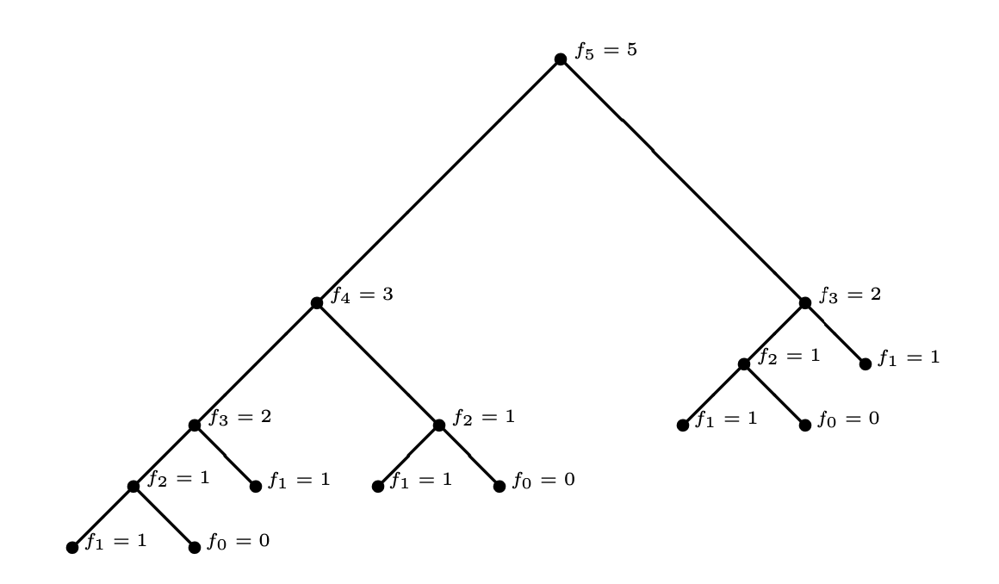
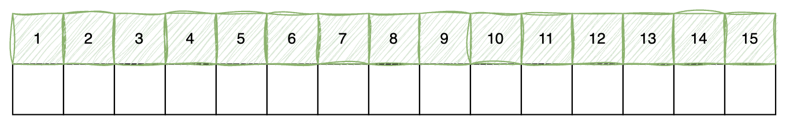
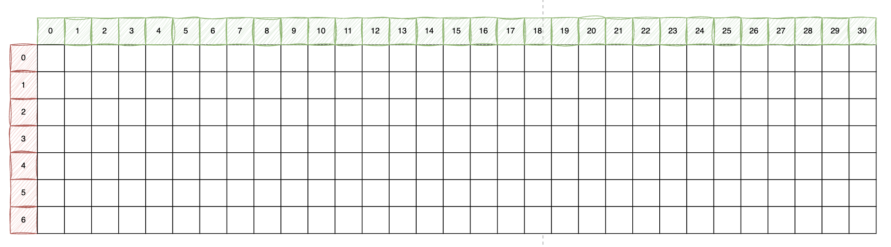
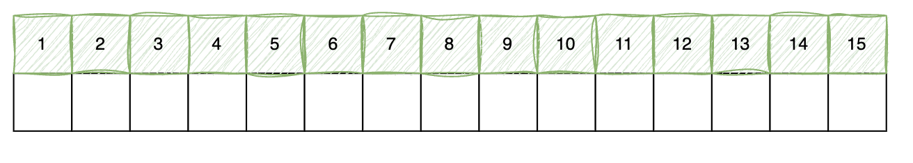
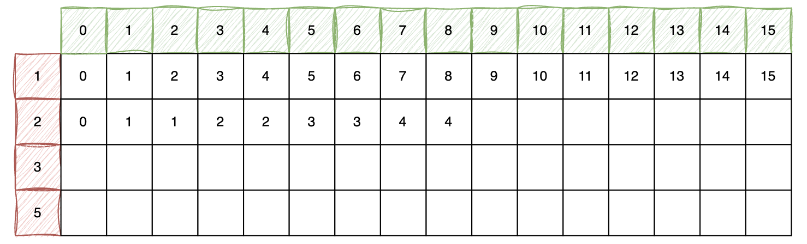

# Dynamic Progrmaming


## Fibonacci numbers

The nth Fibonacci number is the sum of the two previous Fibonacci numbers:
$$
f_n = f_{n-1} + f_{n - 2}, \text{ where } f_0 = 0, f_1 = 1.
$$

Consider the algorithm below:

```Python
def fib(n):
    if n == 0:
        f = 0
    elif n == 1 
        f  = 1
    else:
        f1 = fib(n − 1)
        f2 = fib(n − 2)
        f = f1 + f2 
    return (f)
```

The recusion tree to Evaluate $f_5$:



How to compute the Fibonacci numbers more efficiently?



## 0-1 Knapsack

Suppose you have n items, with value $V = \{v_1, v_2, \cdots, v_n\}$ and weight $W = \{w_1, w_2, \cdots, w_n\}$. And you have a backpack has capacity $M$. How to choose these items to maximum the total value?



**Example :**

```python
V = [1, 2, 3, 5, 7, 10]
W = [2, 3, 5, 8, 13, 16]
M = 30
# Knapsack(V, W, M) => [1, 1, 0, 1, 0, 1]

def Knapsack(D, T):
    pass

# Hint: P[i,m] = max{P[i−1,m−wi]+pi, P[i−1,m]}
```


## Coin Changing 

Assume you have a positive integer $T$, and you have a list of coin denominations $D =\{d_1, d_2 , \cdots, d_n\}$, Find a $A = \{a_1, a_2 , \cdots, a_n\}$, such that:

$$
T = \sum_{i = 1}^n a_i d_i
$$
and such that
$$
N = \sum_{i = 1}^n a_i
$$
is minimized, you many assume d_1 is always 1.





**Example :**

```python
D = [1, 2, 3, 5]
T = 8

# coin_changing(D, T) => 2

def coin_changing(D, T):
    pass
```

