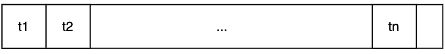
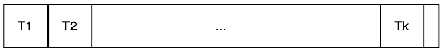
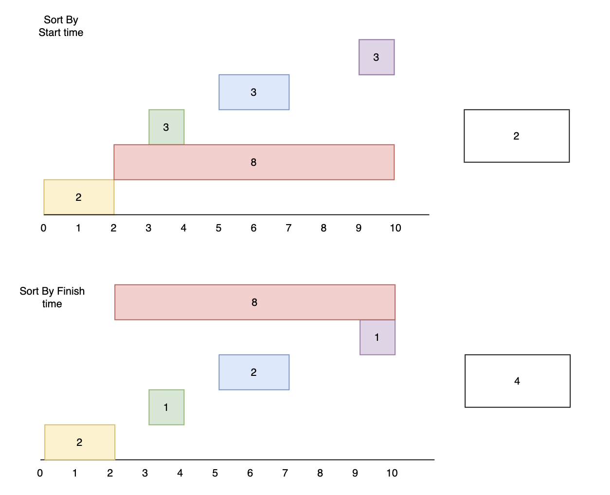
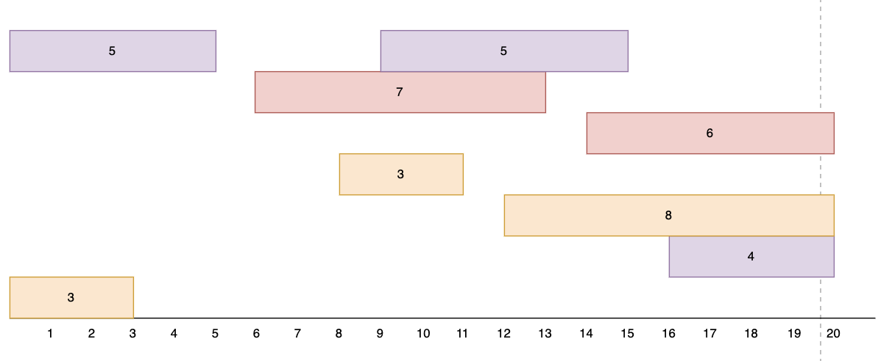

# Greedy Algroithm


## Time on task

You have been asked by a parental unit to do your chores.
Each chore takes a certain amount of time, but you may not have enough time to do all of your chores, since you can only complete one chore at a time. You can do the chores in any order that
you wish.

What is the largest amount of chores you can complete in the given amount of time?

There are some potential Greedy Strategies:

* Sort the chores in decreasing order of time. At any stage, choose the ```biggest chore```.
* Sort the chores in increasing order of time. At any stage, choose the ```smallest chore```.

```python
Total_time = 6
chores = [3, 6, 3]
time_on_task(Total_time, chores) => 2
```

But, how can you make sure the Greedy Strategies you choose is correct?

Suppose the our greedy algroithm gives the solution:



And the optimal solution is:



Since it is the optimal solution, hence $k\geq n$. Consider, what will be the difference between the greedy solution and optimal solution?

Assume the difference of these solutions start at index m, then $T_m$ must be greater than $t_m$. and also $T_{m + 1} > t(m + 1)$, ... , $T_{n} > t(n)$

Then consider, is it possible that $k > n$?

## Interval Selection

Write a function called ```interval_selection```, which takes ```A = {A1, ..., An}``` as input, where ```A_i``` is $\{s_i, f_i\}$, $s_i$ is the start time of interval $A_i$ and $f_i$ is the finish time of $A_i$.


And we call a Feasible solution is: A subset B ⊆ A of pairwise disjoint intervals.

Can you find a feasible solution of maximum size (i.e., one that maximizes |B|)?

```python
def interval_selection(A):
    pass


A_1 = [(0, 2), (2, 10), (3, 4), (5, 7), (9, 10)]
A_2 = [(1, 2), (1, 4), (4, 7), (7, 10), (6, 8)]
interval_selection(A)
```


There are some potential Greedy Strategies:

* Sort the intervals in increasing order of starting times. At any stage, choose the ```earliest starting interval``` that is disjoint from all previously chosen intervals.
* Sort the intervals in increasing order of duration. At any stage, choose the interval of ```minimum duration``` that is disjoint from all previously chosen intervals.
* Sort the intervals in increasing order of finishing times. At any stage, choose the ```earliest finishing interval``` that is disjoint from all previously chosen intervals.



But, how can you make sure the Greedy Strategies is correct?

## Interval Colouring
A set $A = \{A_1, . . . , A_n\}$ of intervals.


For $1 \leq i \leq n$, $A_i = [s_i,f_i)$, where $s_i$ is the start time of interval $A_i$ and $f_i$ is the finish time of $A_i$.

**Feasible solution:**

A c-colouring is a mapping : $A \rightarrow \{1, . . . , c\}$ that assigns each interval a colour such that two intervals receiving the same colour are always disjoint.

Find: 

A c-colouring of A with the minimum number of colours.


**Consider:**

```python
A1 = [0,3] A5 = [16,20] A9 = [12,20]
A2 = [8,11] A3 = [14,20] A6 = [6,13] A7 = [10,15] A10 = [0,5]
```

Any Greedy Strategies?




