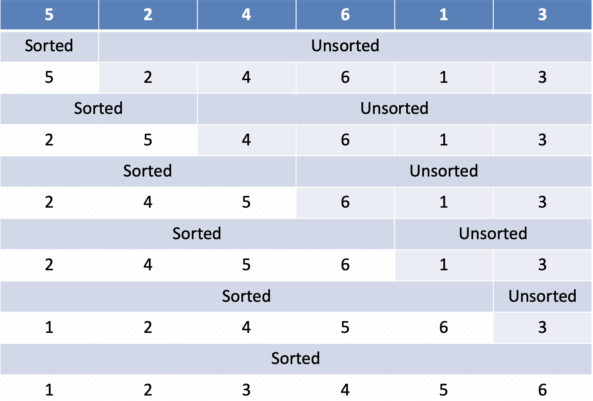
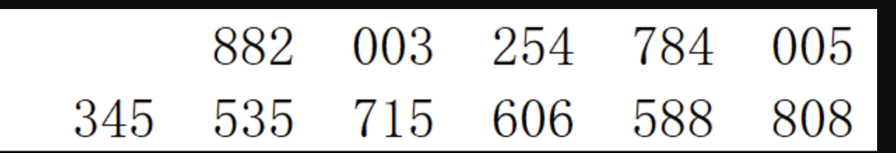
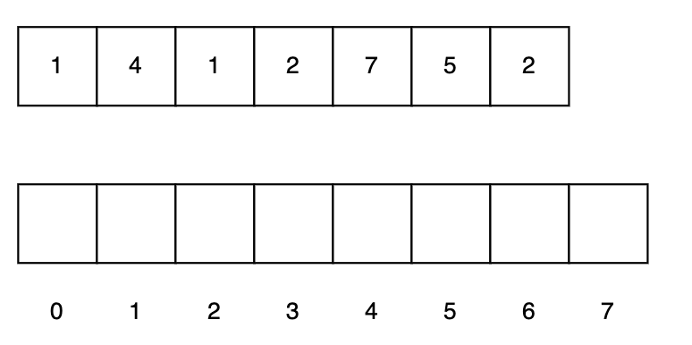

# Insert Sort



```python
def insert(L, pos):
    while pos > 0 and L[pos] < L[pos-1]: 
        temp = L[pos]
        L[pos] = L[pos-1]
        L[pos-1] = temp
        pos = pos-1
def insert_sort(L):
    for i in range(1,len(L)):
        insert(L,i)
```

# Merge Sort

```python
def merge(L1,L2,L):
    pos1,pos2,posL = 0,0,0
    while (pos1 < len(L1)) and (pos2 < len(L2)):
        if L1[pos1] < L2[pos2]: 
            L[posL] = L1[pos1] 
            pos1 += 1
        else:
            L[posL] = L2[pos2] 
            pos2 += 1
    posL += 1
    while (pos1 < len(L1)):
        L[posL] = L1[pos1]
        pos1, posL = pos1+1, posL+1
    while (pos2 < len(L2)):
        L[posL] = L2[pos2]
        pos2, posL = pos2+1, posL+1
    
def mergesort(L):
    if len(L) < 2: return mid = len(L)//2
    L1 = L[:mid]
    L2 = L[mid:] 
    mergesort(L1) 
    mergesort(L2) 
    merge(L1,L2,L)
```

# Quick Sort

```python
def choose_pivot(A): 
    return random(A)

def partition(A, p)
    A: array of size n, p: integer s.t. 0 <= p < n
    swap(A[0], A[p])
    i ← 1, j ← n − 1
    loop
        while i < n and A[i] ≤ A[0] do
            i←i+1
        while j ≥ 1 and A[j] > A[0] do
            j←j−1
        if j < i then break 
        else swap(A[i], A[j])
    end loop
    swap(A[0],A[j])
    return j

def quick_sort(A):
    A: array of size n
    if n <= 1 then return
    p = choose-pivot(A)
    i = partition(A, p)
    quick-sort(A[0, 1, . . . , i − 1])
    quick-sort(A[i + 1, . . . , size(A) − 1])
```

# Non-comparison-based sorting


## Radix-sort

```python
def MSD-Radix-sort(A, l, r, d):
    A: array of size n, contains m-digit radix-R numbers
    l , r , d : integers, 0 ≤ l , r ≤ n − 1, 1 ≤ d ≤ m
    if l < r
        partition A[l..r] into bins according to dth digit if d < m
    for i ← 0 to R − 1 do
        let li and ri be boundaries of ith bin MSD-Radix-sort(A, li , ri , d + 1)
```

## Count Sort

