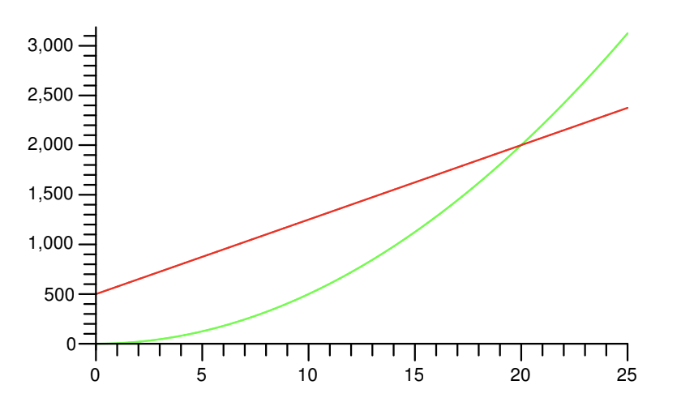

- [Time Efficiency](#time-efficiency)
- [Big O notation](#big-o-notation)
  - [Common Big O](#common-big-o)
  - [Big O rules](#big-o-rules)
- [Big-O in Code](#big-o-in-code)
  - [Analyzing iterative code](#analyzing-iterative-code)
  - [Analyzing recursive code](#analyzing-recursive-code)
- [Space Efficiency](#space-efficiency)
  - [Memory Stack](#memory-stack)


When solving a problem with an algorithm, there may be multiple valid solutions. We can evaluate the efficiency of these solutions based on two key factors: time efficiency and space efficiency.

# Time Efficiency
Time efficiency refers to the speed at which an algorithm runs. While it might seem intuitive to measure this in units of time (seconds, minutes, etc.), we actually measure it in terms of the number of basic operations the algorithm performs. This is because the actual time an algorithm takes to run can vary based on the hardware and software environment.


# Big O notation
Big O notation is used to express the upper bound of an algorithm's time complexity in the worst-case scenario. It provides an asymptotic upper bound, meaning it describes the limiting behavior of a function when the argument tends towards infinity.


**Defination**:

O-notation: $f (n) \in O(g(n))$ if there exist constants $c > 0$ and $n_0 > 0$, such that $|f (n)| \leq c |g(n)|$ for all $n \geq n_0$.

**Example**:
$f(n) = 75n + 500$ and $g(n) = 5n^2$

If we take c = 1 and $n_0 = 20$, then for all $n \geq n_0$, we can say that $|f (n)| \leq c |g(n)|$.



We can say that $f(n) \in O(g(n))$

**Exercise**:

Prove
- $f(n) = 2023$, $g(n) = 1$, $f(n) \in O(g(n))$
- $f(n) = n$, $g(n) = n^2$, $f(n) \in O(g(n))$
- $f(n) = n + \log n$, $g(n) = n$, $f(n) \in O(g(n))$


## Common Big O
Here are the common Big O notations, sorted from best to worst performance:


$$
O(1) < O(\log n) < O(n) < O(n \log n) < O(n^2) < O(2^n)
$$


## Big O rules
When adding two orders, the result is the largest of the two orders.

$$
O(\log n) + O(n) = O(n)\\
O(1) + O(1) = O(1)
$$

When multiplying two orders, the result is the product of the two orders.

$$
O(\log n) \times O(n) = O(n \log n)\\
O(n) \times O(n) = O(n^2)
$$

**Example**:

Here T(n) is the total operation, n is the size of the input.

$$
\begin{aligned}
    f(n) = 12 \log n + 45 &\in O(\log n)\\
    f(n) = 12 \log n + 45 n&\in O(n)\\
    f(n) = n^2 + 2^n &\in O(2^n)\\
\end{aligned}
$$

**Exercise**:

Bound the following $f(n)$ in big-O notation.

$$
\begin{aligned}
    f(n) = n * \log (n - 1)\\
    f(n) = n * (n^2 + 2 \log(n))\\
    f(n) = 1 + T(n / 2)\\
    f(n) = n + T(n - 1)\\
    f(n) = T(n - 1) + T(n - 2)\\
\end{aligned}
$$

# Big-O in Code

We denote the number of operations as $T(n)$, where $n$ is the size of the input. Different operations have different time complexities, even for built-in functions.

Consider the following built-in Python functions and their time complexities:

```python
lst = [1, 2, 3, ..., n] # A list has n numbers
lst[0]      # T(n) = 1
lst.append(1)    # T(n) = 1
len(lst)    # T(n) = n
max(lst)    # T(n) = n
lst[1:]     # T(n) = n - 1

M = [1, 2, 3, ..., m] # A list has m numbers
lst + M     # T(n) = n + m
```

Here's how we can analyze the time complexity of functions:

**Example**

```python
def sum_all(lst): 
    sum = 0
    ind = 0
    length = len(lst)       # O(n)
    while (ind < length):
        sum = sum + lst[ind] # O(1)
        ind = ind + 1        # O(1)
    return sum
```

Here, len(lst) is O(n). The while loop runs n times (where n is the length of the list), and each operation inside the loop (addition and assignment) is also O(1). Therefore, the overall time complexity is $O(n) + n * O(1) = O(1)$

**Example**
```python
def factorial(n):
    if n == 0:              
        return 1
    else:
        return n * factorial(n-1)
```

This is a recursive function. For each value of n, the function calls itself with n-1. Hence, the time complexity is O(n).

**Example:**

```Python
def foo(L):
    if (len(L) > 0):
        return 0
    else:
        return foo(L[1:])
```

$$
T(n) = (n - 1) + \cdots + 1 \in O(n^2)
$$

## Analyzing iterative code

**Exercise**:

What is the running time of the below code? Write in Big O form.

```Python
def foo(L):
    for i in range (10000000):
        print(i)
```

```Python
def foo(L):
    n = len(L)
    for i in range(n):
        for j in range(n):
            print (i * j)
```

```Python
def foo(L):
    n = len(L)
    for i in range(n):
        if (i == n // 2):
            for j in range(i):
                print (j)
```


## Analyzing recursive code

**Example**:
```Python
def foo(n):
    if (n <= 0):
        return 0
    else:
        return foo(n / 2) 
```

```Python
def foo(n):
    if (n <= 0):
        return 0
    else:
        return foo(n - 1) + foo(n - 1)
```

**Exercise**:
```Python
def foo(n):
    temp = 0
    for i in range(n):
        temp += 1
    
    if (n <= 0):
        return 0
    else:
        return foo(n / 2) + foo(n / 2)
```

# Space Efficiency

Space efficiency is another critical aspect when evaluating algorithms. It refers to the amount of memory an algorithm needs to run. Similar to time efficiency, space efficiency depends on the size of the input, denoted as S(n).

The space complexity of an algorithm quantifies the amount of space or memory taken by an algorithm to run as a function of the length of the input. It's important because your computer's memory isn't infinite, and optimizing the use of memory often improves an algorithm's performance.


## Memory Stack
Every time you initialize a variable, that variable will be stored in a stack

```python
def add_stack(n):
    s = n + 1
    lst = [0, 2, 3]
    return lst
```

```
|     | <- Top of the stack
| lst |
|  s  | <- Locals for add_stack    
|0x2b5| <- return address          
|  n  | <- parameters for add_stack
```

**Example**

For instance, consider the following function:

```python
def factorial(n):
    if n == 0:              
        return 1
    else:
        return n * factorial(n-1)
```

In this case, each call to ```factorial``` will remain on the call stack until it has been resolved, which means that for large values of n, the space complexity is $O(n)$.


