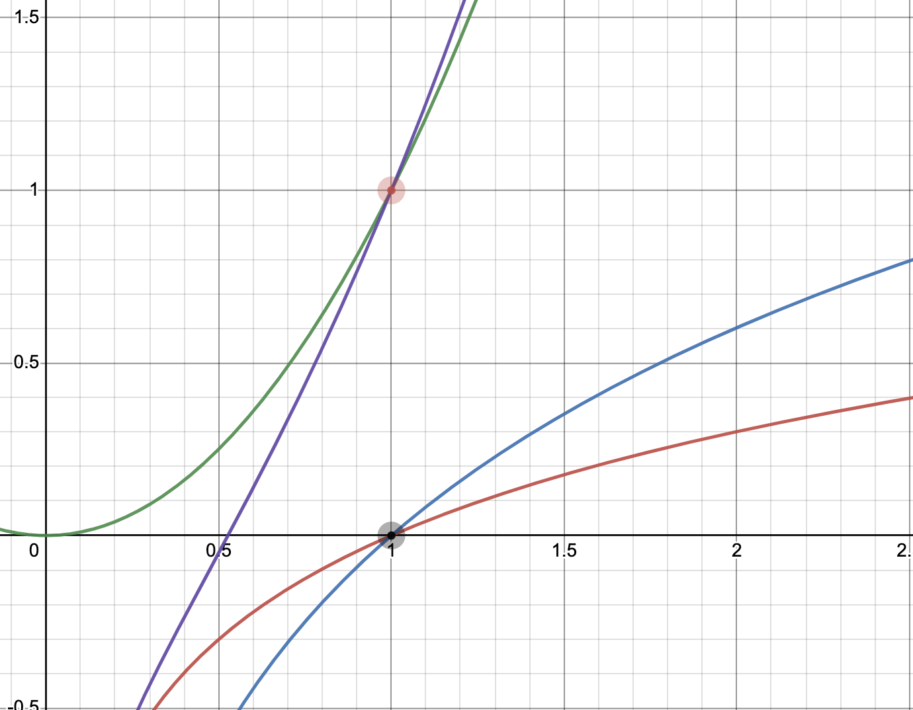

# Running Time

## O-notation:

$f(n) \in O(g(n))$ if there exist constant c and $n_0 > 0$ such that $0 \leq f(n) \leq cg(n)$ for all $n \geq n_0$.

**Example**: consier following functions
- $f(n) = \log(n)$
- $g(n) = 2\log(n)$
- $h(n) = n^2$
- $p(n) = n^2 + \log(n)$




## Number of operations
In the worst case, what is the number of operations executed when calling this function?

```python
def sum_all(values): 
    sum = 0
    ind = 0
    upper = len(values) 
    while (ind < upper):
      sum = sum + values[ind]
      ind = ind + 1 
    return sum
```

**Consider:** if the value is n, can you express the number of operations in big O notation

2n + 3 $\in$ O(n) 

# Efficiency
Suppose you have two algorithms to solve a problem. How can we determine which one is better?
- Time Efficiency
- Space Efficiency

The actual time taken is not a great choice. Instead, we will count number of steps or basic operations performed. We will use T(n) to denote the number of operations.

Consider following buildin functions:
```Python
lst = [1, 2, 3, ..., n] # A list has n numbers
lst[0]      # T(n) = 1
lst.append(1)    # T(n) = 1
len(lst)    # T(n) = n
max(lst)    # T(n) = n
lst[1:]     # T(n) = n - 1

M = [1, 2, 3, ..., m] # A list has m numbers
lst + m     # T(n) = n + m
```

**Example**:
What is the number of operations executed when calling this function?
```Python
def factorial(n):
    if n == 0:              
        return 1
    else:
        return n * factorial(n-1)
```

**Exercise**:
What is the number of operations executed when calling this function?

```Python
def foo(n):
    if n == 0:              
        return 1
    else:
        return foo(n-1) + foo(n - 2)
```
```Python
def foo(n):
    if n == 0:              
        return 1
    else:
        return foo(n / 2)
```

## Important Big O notations

Big O Examples:

$$
\begin{aligned}
    T(n) = 2016 &= O(1)\\
    T(n) = 12 \log n + 45 &= O(\log n)\\
    T(n) = 12 \log n + 45 n&= O(n)\\
    T(n) = n^2 + 2^n &= O(2^n)\\
\end{aligned}
$$

Important Big O notation:

$$
O(1) < O(\log n) < O(n) < O(n \log n) < O(n^2) < O(2^n)
$$

When adding two orders, the result is the largest of the two orders.

$$
O(\log n) + O(n) = O(n)\\
O(1) + O(1) = O(1)
$$

When multiplying two orders, the result is the product of the two orders.

$$
O(\log n) \times O(n) = O(n \log n)\\
O(n) \times O(n) = O(n^2)
$$

$$
n - 1 \in O(n)\\
2n \in O(n)\\
6538n \in O(n)\\

6538n^2 \in O(n ^ 2)\\
3567n^2 + 6756 n \in O(n ^ 2)\\
2n^2 + \log n \in O(n^2)
$$


**Exercise**:
```Python
def foo(L):
    for i in range (10000000):
        print(i)
```

```Python
def foo(L):
    if (len(L) == 0):
        return 0
    else:
        return foo(L[1:])
```

**Exercise**:
```Python
def foo(L):
    n = len(L)
    for i in range(n):
            for j in range(n):
                print (i * j)
```

```Python
def foo(L):
    n = len(L)
    for i in range(n):
        for j in range(i):
            print (j)
```

```Python
def foo(L):
    n = len(L)
    if (n <= 0):
        return 0
    else:
        return foo(L[n//2:]) + foo(L[:n//2])
```

2 ^ 10 = 1024

log 1024 = 10

```Python
def foo(L):
    if (n <= 0):
        return 0
    else:
        return foo(n / 2) + foo(n / 4)
```