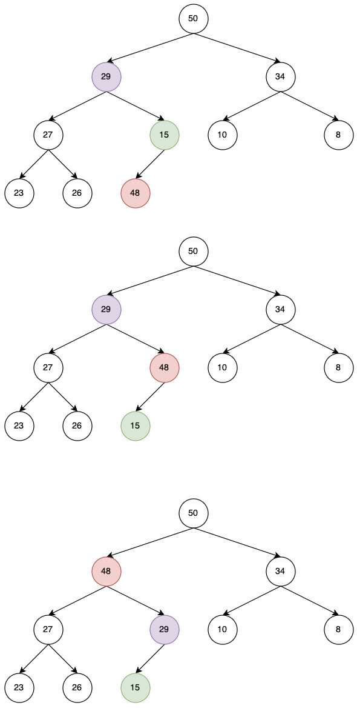
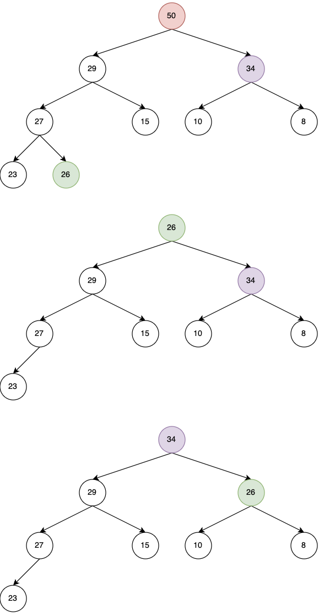

# Priority Queue ADT

Consider a Priority Queue ADT with following operations:
- ```insert```: inserting an item tagged with a priority
- ```deleteMax```: removing the item of highest priority

How can we implement this Priority Queue ADT?

## Attempt I: arrays

We can use  arrays to store the item, for example:

```pyhton
Attempt_I = [("apple", 2), ("banana", 10), ("orange", 1)]
```

**Insert**: O(1)

**DeleteMax**: O(n)

Then we can consider a sorted array

```pyhton
Attempt_I = [("apple", 10), ("banana", 2), ("orange", 1)]
```

**Insert**: O(n)

**DeleteMax**: O(1)

## Attempt II: heap


A tree is heap-ordered if the key in each node is larger than or equal to the keys in all of that node's children (if any). Equivalently, the key in each node of a heap-ordered tree is smaller than or equal to the key in that node's parent (if any)

## Insertion in Heap

- Place the new key at the first free leaf
- The heap-order property might be violated: perform a bubble-up:
- The new item bubbles up until it reaches its correct place in the heap.

For example, we insert 48 to the following heap.


```python
def bubble-up(v):
v: a node of the heap

while parent(v) exists and key(parent(v)) < key(v) do
    swap v and parent(v)
    v = parent(v)
```

Time:
$O$(height of heap) = $O$($\log n$).

## Delete Max in heap

- The maximum item of a heap is just the root node.
- We replace root by the last leaf
- The heap-order property might be violated: perform a bubble-down:
  




```python
def bubble-down(v):
v: a node of the heap

while v is not a leaf do
    u <- child of v with largest key
    if key(u) > key(v) then
        swap v and u
        v←u 
    else
        break
```
Time: $O$(height of heap) = $O (\log n)$.

## Heap Structure

**Tree-like Heap**

Heaps can be implemented in a tree-like structure using Node objects. Here, each Node object maintains a reference to its left and right children and holds its value.

```python
class Node:
    def __init__(self, val):
        self.val = val
        self.left = None
        self.right = None

class MaxHeap:
    def __init__(self):
        self.root = None

    # Implement insert, getMax, deleteMax, and helper methods here
```

**Array-like Heap**

Heap can also be implemented in an array-like structure. The parent-child relationship can be calculated by their indices. If a node is represented by an index $i$, its left child is represented by $2*i + 1$ and its right child by $2*i + 2$. The parent of the node $i$ is given by $\frac{(i-1)}{2}$.

```python
class MaxHeap:
    def __init__(self):
        self.heap = []

    def insert(self, val):
        self.heap.append(val)
        self.__percolateUp(len(self.heap)-1)

    def getMax(self):
        if self.heap:
            return self.heap[0]
        return None

    def deleteMax(self):
        if len(self.heap) > 1:
            maxVal = self.heap[0]
            self.heap[0] = self.heap[-1]
            del self.heap[-1]
            self.__maxHeapify(0)
            return maxVal
        elif len(self.heap) == 1:
            maxVal = self.heap[0]
            del self.heap[0]
            return maxVal
        else:
            return None

    def __percolateUp(self, index):
        parent = (index-1)//2
        if index <= 0:
            return
        elif self.heap[parent] < self.heap[index]:
            tmp = self.heap[parent]
            self.heap[parent] = self.heap[index]
            self.heap[index] = tmp
            self.__percolateUp(parent)

    def __maxHeapify(self, index):
        left = (index * 2) + 1
        right = (index * 2) + 2
        largest = index
        if len(self.heap) > left and self.heap[largest] < self.heap[left]:
            largest = left
        if len(self.heap) > right and self.heap[largest] < self.heap[right]:
            largest = right
        if largest != index:
            tmp = self.heap[largest]
            self.heap[largest] = self.heap[index]
            self.heap[index] = tmp
            self.__maxHeapify(largest)

```

## Building a Heap from a list

Problem statement: Given n items (in $A[0, · · ·, n − 1]$) build a heap containing all of them.

### Sample Solution
 Start with an empty heap and insert items one at a time:

 ```python
def heapify1(A):
A: an array
initialize H as an empty heap
for i = 0 to size(A) − 1 do
    heapInsert (H , A[i ])
 ```

 Time: O($n \log n$)

 ### Solution 2
Using bubble-downs instead:
 ```python
heapify (A) 
A: an array
n ← size(A) − 1
for i ← ⌊n/2⌋ downto 0 do
    bubble−down(A,i)
 ```


