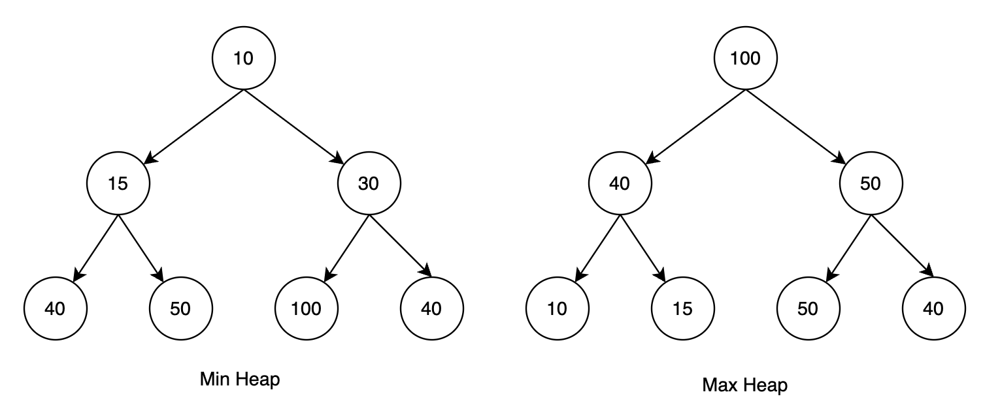

# Priority Queue ADT

Consider a Priority Queue ADT with following operations:
- ```insert```: inserting an item tagged with a priority
- ```deleteMax```: removing the item of highest priority

How can we implement this Priority Queue ADT?

## Attempt I: arrays

We can use  arrays to store the item, for example:

```pyhton
Attempt_I = [("apple", 2), ("banana", 10), ("orange", 1)]
```

**Insert**: O(1)

**DeleteMax**: O(n)

Then we can consider a sorted array

```pyhton
Attempt_I = [("apple", 10), ("banana", 2), ("orange", 1)]
```

**Insert**: O(n)

**DeleteMax**: O(1)

## Attempt II: heap




A tree is heap-ordered if the key in each node is larger than or equal to the keys in all of that node's children (if any). Equivalently, the key in each node of a heap-ordered tree is smaller than or equal to the key in that node's parent (if any)

## Insertion in Heap

- Place the new key at the first free leaf
- The heap-order property might be violated: perform a bubble-up:
- The new item bubbles up until it reaches its correct place in the heap.

```python
def bubble-up(v):
v: a node of the heap

while parent(v) exists and key(parent(v)) < key(v) do
    swap v and parent(v)
    v = parent(v)
```

Time:
$O$(height of heap) = $O$($\log n$).

## Delete Max in heap

- The maximum item of a heap is just the root node.
- We replace root by the last leaf
- The heap-order property might be violated: perform a bubble-down:
  
```python
def bubble-down(v):
v: a node of the heap

while v is not a leaf do
    u <- child of v with largest key
    if key(u) > key(v) then
        swap v and u
        v←u 
    else
        break
```
Time: $O$(height of heap) = $O (log n)$.

## Building Heap

Problem statement: Given n items (in $A[0, · · ·, n − 1]$) build a heap containing all of them.

### Sample Solution
 Start with an empty heap and insert items one at a time:

 ```python
heapify1(A)
A: an array
initialize H as an empty heap
for i = 0 to size(A) − 1 do
    heapInsert (H , A[i ])
 ```

 Time: O($n \log n$)

 ### Solution 2
Using bubble-downs instead:
 ```python
heapify (A) 
A: an array
n ← size(A) − 1
for i ← ⌊n/2⌋ downto 0 do
    bubble−down(A,i)
 ```

## Using a Priority Queue to Sort

```python
def HeapSort (A):
heapify (A)
for i ← 0 to n − 1 do
    A[n − 1 − i] ← heapDeleteMax(H)
```

Running time of HeapSort: $O(n log n)$


