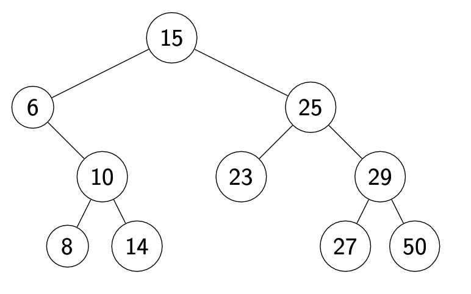
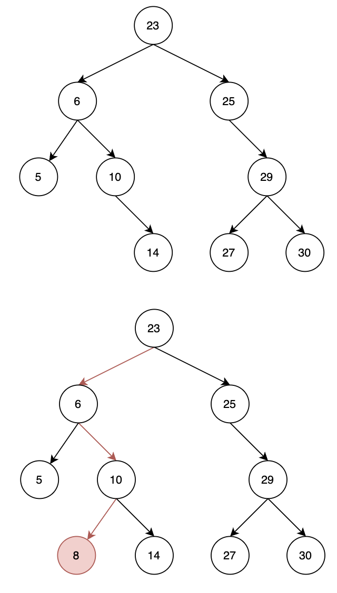
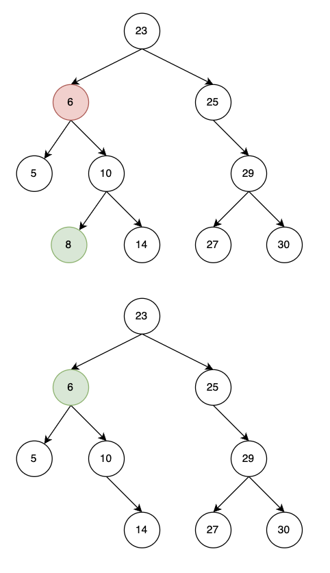
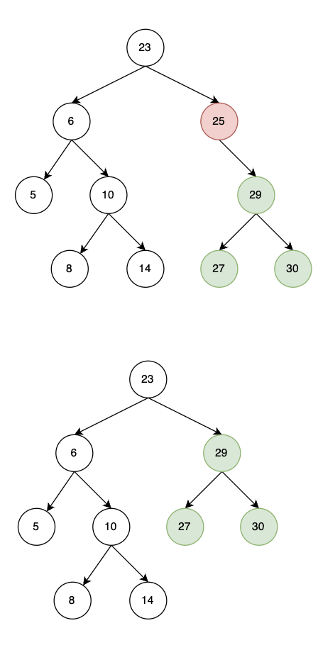
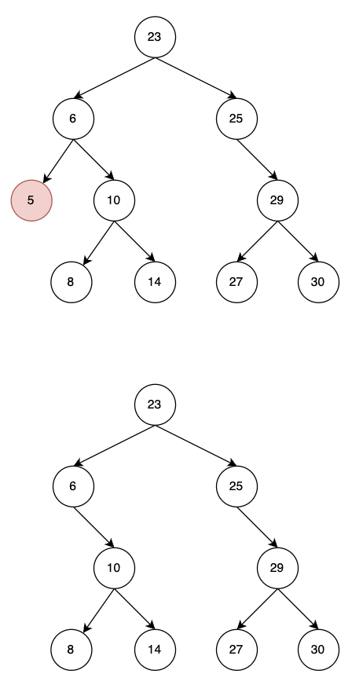
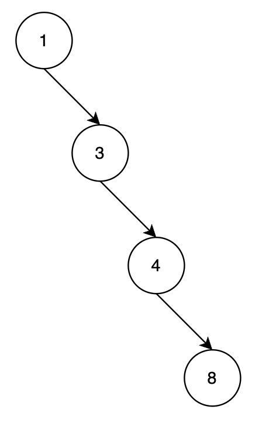

# Binary Search Tree (BST)

A Binary Search Tree (BST) is a tree data structure in which each node has at most two children, referred to as the left child and the right child. For each node, all elements in the left subtree are less than the node, and all elements in the right subtree are greater than the node. This property makes the search function more efficient.



## BST Insert
- If node value > insert value, go left
- If node value < insert value, go right




## BST Delete
**If node is a leaf, just delete it.**




**If node has one child, move child up**



**Else put the right node's leftest leaf up.**



## BST Implementation

Here is a basic implementation of a BST in Python:

```python
class Node:
    def __init__(self, key):
        self.left = None
        self.right = None
        self.val = key

class BST:
    def __init__(self):
        self.root = None

    def insert(self, root, key):
        if root is None:
            return Node(key)
        else:
            if root.val < key:
                root.right = self.insert(root.right, key)
            else:
                root.left = self.insert(root.left, key)
        return root

    def search(self, root, key):
        if root is None or root.val == key:
            return root

        if root.val < key:
            return self.search(root.right, key)

        return self.search(root.left, key)
```

**Complexity of BST Operations:**

- Search: O(log n)
- Insert: O(log n)
- Delete: O(log n)

The complexities are in terms of height of the BST and for a skewed BST, the height becomes n and all these operations have a worst case time complexity of O(n).

Worst case BST:



**Exercise 8**: Implement a delete function for the BST.

---

## Advantages of BST

1. All operations (search, insert, delete) can be performed in O(log n) time with a height balanced BST.
2. They use memory efficiently to store multiple pieces of data that are easily retrievable.
3. They allow for fast lookup, addition and removal of items.
4. BSTs are good for dictionary problems where the code inserts and looks up information.

---

## Balanced BST

A Binary Search Tree is balanced if for any two leaves the difference of the depth is at most one. Balancing a tree guarantees that its height is O(log n), where n is the number of elements in the tree, which ensures the aforementioned time complexities for search, insert and delete operations.

---

## BST Traversal

There are three common ways to traverse them in depth-first order: in-order, pre-order and post-order.

- In-order traversal visits the left subtree, the root node, and then its right subtree. For BSTs, this order visits the nodes in ascending order.
- Pre-order traversal visits the root node, the left subtree, and then the right subtree.
- Post-order traversal visits the left subtree, the right subtree, and then the root node.

**Exercise 9**: Implement in-order, pre-order and post-order traversal for the BST.

---

## Summary

Binary Search Trees are a type of container that allows for fast lookup, insertion, and deletion operations. They are excellent for searching and provide a way to maintain an ordered list of numbers. Remember that BSTs are not inherently balanced, and may need to be balanced to maintain their efficiency.