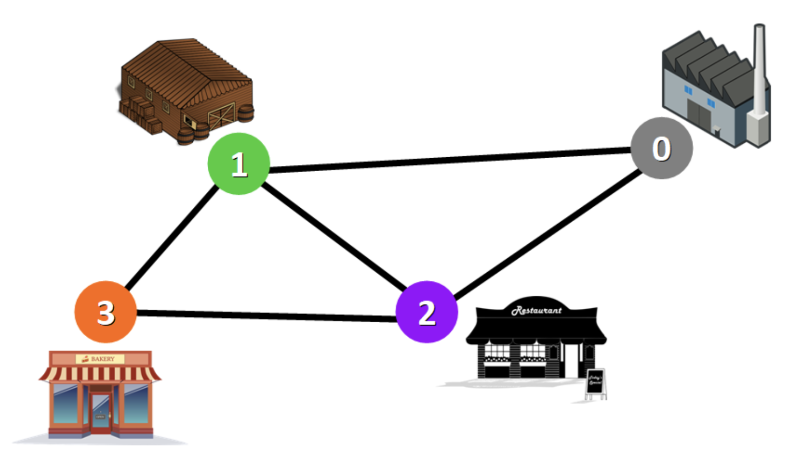
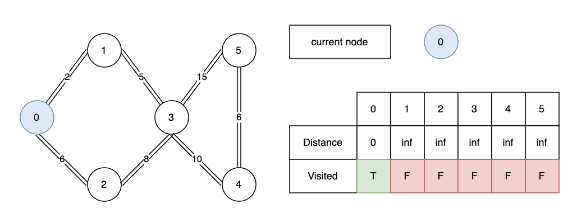
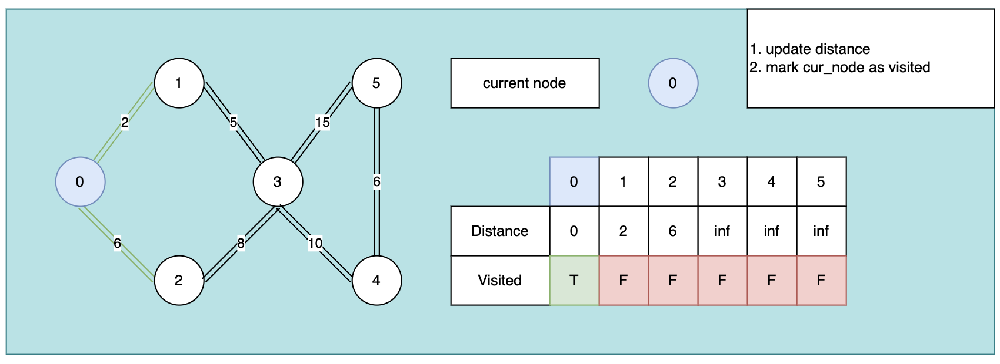
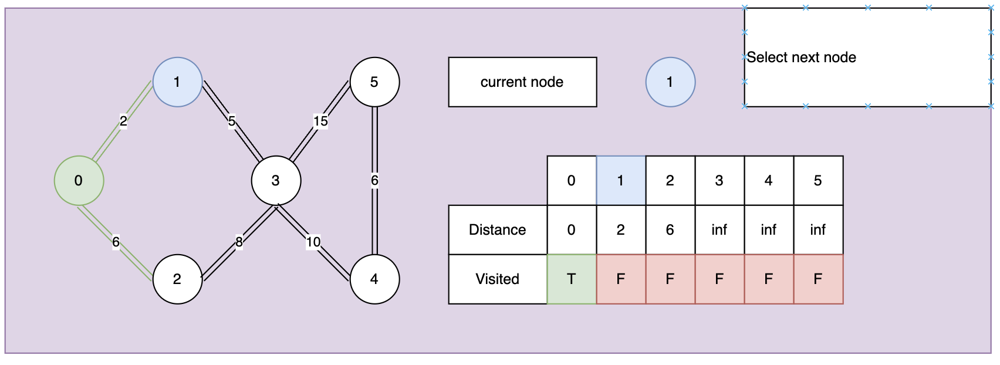
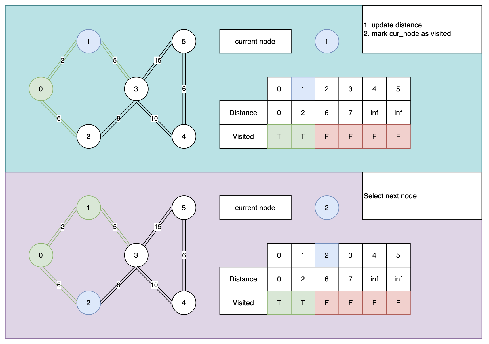
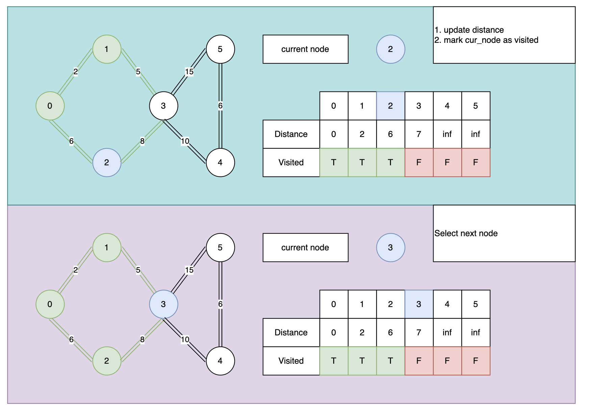
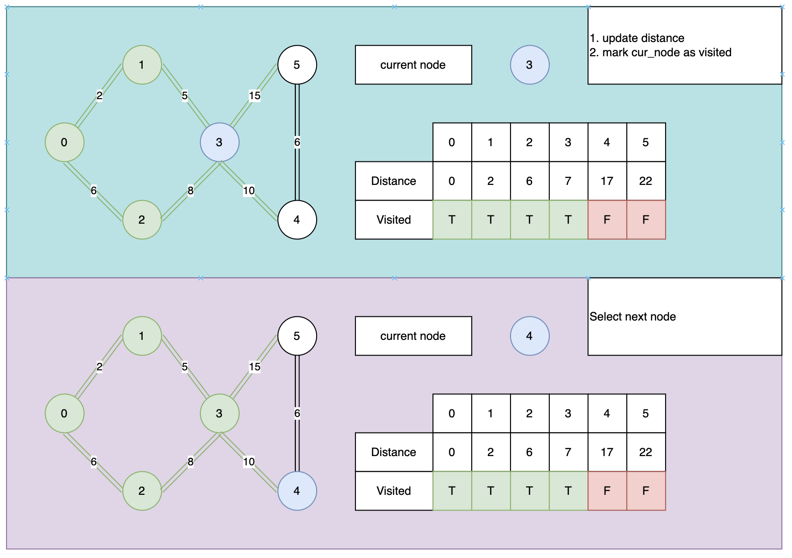
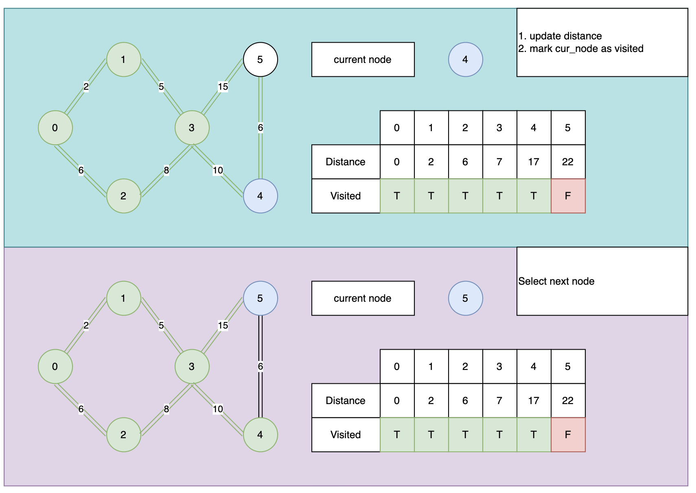
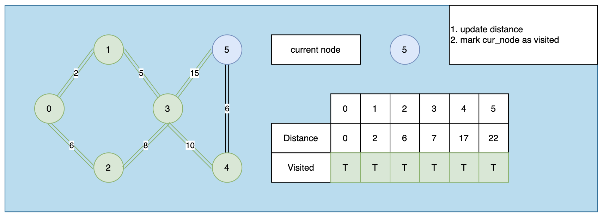

# Dijkstra

## Background

Dijkstra's algorithm is a fundamental algorithm in computer science, used for finding the shortest path between nodes in a graph, which may represent, for example, road networks. The algorithm was conceived by computer scientist Edsger W. Dijkstra in 1956 and published three years later.

<center>
    
</center>


GPS devices use this algorithm to find the shortest path from your current location to a target location. Dijkstra's algorithm is widely used in industry, especially in areas where network modeling is required

## Algorithm

The algorithm works by iteratively selecting the node with the smallest distance estimate from the starting node and updating the distance estimates of its neighbors. 


**Initialization:** Start by setting the distance to the start node to 0 and to all other nodes to infinity. Set the initial node as current.

<center>
    
</center>   


**Exploration**: 

1. From the current node, examine its unvisited neighbors. For each neighbor, calculate the distance from the start node by summing the current node's distance. If this calculated distance is less than the neighbor's recorded distance, update the neighbor's distance.
2. Once all neighbors are checked, mark the current node as visited. A visited node will not be checked again.

<center>
    
</center>   

**Select Next Node**: Select the unvisited node with the smallest distance estimate. If there are no unvisited nodes, or the smallest distance among them is infinity, the algorithm ends.

<center>
    
</center>   

**Repeat**: Repeat steps 2-5 until all nodes have been visited or the smallest distance among the unvisited nodes is infinity.

<center>
    
</center>   


<center>
    
</center>   


<center>
    
</center>   

<center>
    
</center>   

<center>
    
</center>   

## Implementation

Assume we have graph has structed like below:

```python
N = 10  # number of vertex in graph
M = 20
graph = [[] for _ in range(N + 1)]

# 
for i in range(M):
    a, b, weight = map(int, input().split())
    graph[a].append((b, weight))
    graph[b].append((a, weight))
```

```python
def minDistance(distance, spf, N):
    min = 1e7
    min_index = -1
    for v in range(N):
        if distance[v] < min and spf[v] == False:
            min = distance[v]
            min_index = v
 
    return min_index
```

```python
def dijkstra(graph, src, N, K, target):
    distance = [1e7] * (N + 1)                              # Set all distance to the src = infity
    distance[src] = 0                                       # Set src to src = 0

    shortest_path_found = [False] * (N + 1)                 # No node is calulated yet

    curnode = src

    while(curnode != -1):
        curnode = minDistance(distance, shortest_path_found, N + 1)

        if (curnode == target):
            print(distance[target])
            return
        
        shortest_path_found[curnode] = True

        for adj, adj_weight in graph[curnode]:
            if (shortest_path_found[adj] == False and distance[adj] > distance[curnode] + adj_weight):
                distance[adj] = distance[curnode] + adj_weight

    print(-1)
```

## Imporved Version

using `PriorityQueue` to reduce `minDistance`'s running time (sometime we use a `heapq`)

```python
def dijkstra(graph, src, N, K, target):
    distance = [1e7] * (N + 1)                              # Set all distance to the src = infity

    distance[src] = 0                                       # Set src to src = 0
    curnode = src

    q = PriorityQueue()
    q.put((0, src))

    while(curnode != -1):
        _, curnode = q.get()

        if (curnode == target):
            print(distance[target])
            return
        
        shortest_path_found[curnode] = True

        for adj, adj_weight in graph[curnode]:
            new_distance = distance[island] + adj_weight

            if (shortest_path_found[adj] == False and distance[adj] > new_distance):
                distance[adj] = distance[curnode] + adj_weight
                q.put((new_time, adj))

    print(-1)
```

## Exercise:

You are travelling on a ship in an archipelago. The ship has a convex hull which is *K* centimetres thick. The archipelago has *N* islands, numbered from *1* to *N*. There are *M* sea routes amongst them, where the ith route runs directly between two different islands *a<sub>i</sub>* and *b<sub>i</sub>* *(1 ≤ a<sub>i</sub>, b<sub>i</sub> ≤ N)*,takes *t<sub>i</sub>* minutes to travel along in either direction. There may be multiple routes running between a pair of islands.

You would like to travel from island *A* to a different island *B* *(1 ≤ A, B ≤ N)* along a sequence of sea routes

You are in a hurry, so you would like to minimize the amount of time necessary to reach island *B* from island *A*. It may not be possible to reach island *B* from island *A*.

**Input Specification**

The first line of input contains two integers *N* and *M* *(2 ≤ N ≤ 2000, 1 ≤ M ≤ 10000)*, each separated by one space.

The next *M* lines each contain 3 integers *a<sub>i</sub>* *b<sub>i</sub>* *t<sub>i</sub>* *(1 ≤ a<sub>i</sub>, b<sub>i</sub> ≤ N, 1 ≤ t<sub>i</sub> ≤ 10<sup>5</sup>)*, each separated by one space. 

The *i* th line in this set of *M* lines describes the *i* th sea route (which runs from island *a<sub>i</sub>* to island *b<sub>i*
, takes *t<sub>i</sub>* minutes and wears down the ship’s hull by *h<sub>i</sub>* centimetres). Notice that *a<sub>i</sub> ≠ b<sub>i</sub>* (that is, the ends of a sea route are distinct islands).

The last line of input contains two integers *A* and *B* (*1 ≤ A*, *B ≤ N*; *A ≠ B*), the islands between which we want to travel.

**Output Specification**

Output a single integer: the integer representing the minimal time required to travel from A to B, or −1 to indicate that there is no way to travel from A to B.

**Sample Input 1**

```
4 7
1 2 4
1 3 7
3 1 8
3 2 2
4 2 1
3 4 1
1 4 6
1 4
```


