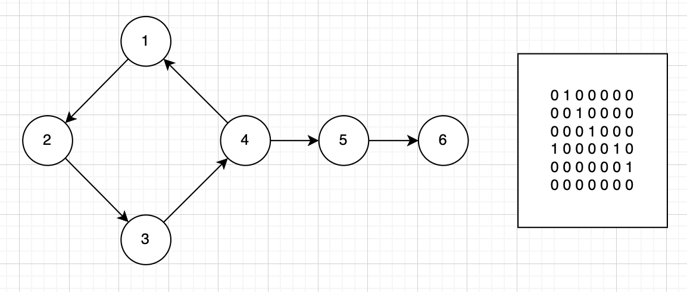
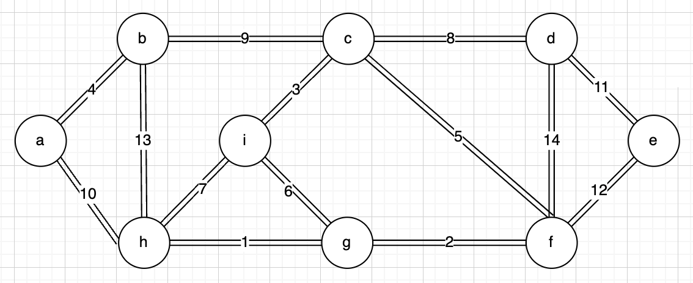
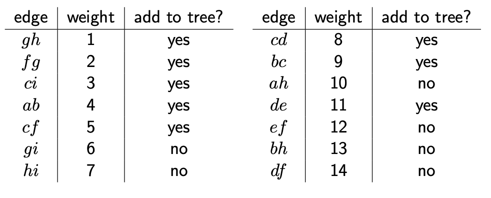
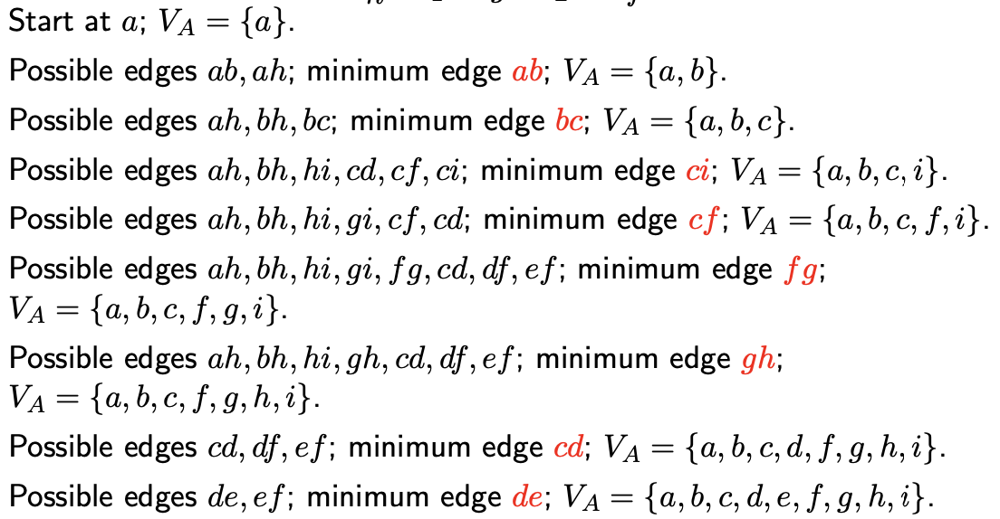
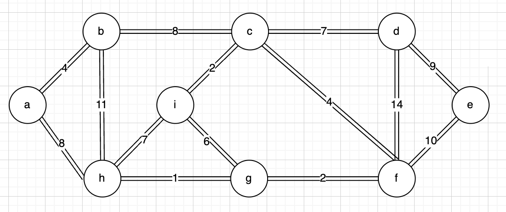
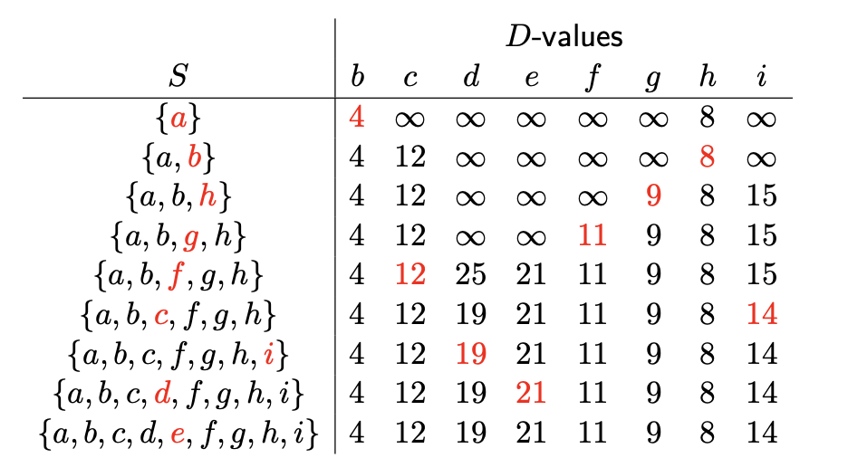

# Graph

# Data Structures for Graphs:
There are two main data structures to represent graphs: an adjacency matrix and a set of adjacency lists.

## Adjacency Matrices
Let $G=(V,E)$ be a graph with $|V|=n$ and $|E|=m$. The adjacency matrix of $G$ is an $n$ by $n$ matrix.



## Adjacency Lists

An adjacency list representation of G consists of n linked lists.

For every u ∈ V , there is a linked list (called an adjacency list) which is named Adj[u].

For every v ∈ V such that uv ∈ E, there is a node in Adj[u] labelled v. 

$$
Adj[1]: 2\\
Adj[2]: 3 \\
Adj[3]: 4 \\
Adj[4]: 1\rightarrow5\\
Adj[5]: 6\\
Adj[6]: 
$$

## Application

### Traveling Salesperson Problem


### Propositional Satisfiability

Given a propositional formula, is there a way to assign truth values to the variables to make the formula true?

$$
((((a \wedge b) \vee c) \wedge d) \vee (\neg e))
$$

### Hua rong Pass Puzzle


### 8 Puzzle


---

# Graph Search


### Formally a Graph Search

A search Problem is defined by:

-  A set of states
-  A start state
-  Goal State
-  A succeror (neighbour) function
-  (opt) A cost associated with each action

### Example


Question: How to formulating 8-puzzle as a Search Problem

Question: Which of the following is a successor of 530, 976, 241?

- 350, 876, 241
- 536, 870, 241
- 537, 806, 241
- 538, 076, 241

### Generate a Search Tree


```Python
# G => The Graph
# s => start state
# goal(n) => Goal test
def generalSearchProblem(G, s, goal(n)):
    frontier = {[s]}

    while frontier is not empty:
        select and remove path <n0, ..., nk> from frontier

        if (goal(nk)):
            return <n0, ..., nk> 
        
        for every neighbour n of nk:
            add <n0, ..., nk> to frontier
        
    return no solution
```


# Uniformed Search Algroithms

### Deap-First Search

- Treat the frontier as a stack (Last in first out)
- Expand the last recent node added to forntier

#### Trace DFS on the search tree


#### Properties of DFS
- Space complexity?
- Time complexity?
- Guaranteed to find a solution if on exists?

#### Try DFS on this grid search problem
- Expand the succerrors in the order: up, left, right and down
- Number the nodes as they are removed from the frontier
- Use cycle pruning


### Breadth-first Search

- Treat the frontier as a queue (First in first out)
- Expand the oldest node added to forntier

#### Trace BFS on the search tree


#### Properties of BFS
- Space complexity?
- Time complexity?
- Guaranteed to find a solution if on exists?

#### Try BFS on this grid search problem
- Expand the succerrors in the order: up, left, right and down
- Number the nodes as they are removed from the frontier
- Use cycle pruning


## Compareing BFS and DFS

Which of BFS and DFS would you choose? Why?
1. Memory is limited.
2. All solutions are deep in the tree.
3. The search graph contains cycles.
4. The branching factor is large/infinite.
5. We must find the shallowest goal node.
6. Some solutions are very shallow.

## Exercise:

- Suppose that mempry is very limited. Which of BFS and DFS would you choose?
  - BFS
  - DFS
  - Both
  - Neither

- Suppose that all solutions are deep in the search tree. Which of BFS and DFS would you choose?
  - BFS
  - DFS
  - Both
  - Neither

- Suppose that we must find the shallowest goal node. Which of BFS and DFS would you choose?
  - BFS
  - DFS
  - Both
  - Neither

- Suppose that all solutions are shallow in the search tree. Which of BFS and DFS would you choose?
  - BFS
  - DFS
  - Both
  - Neither

## Lowest-cost first search
What if arcs have different costs?

We want an algorithm to find the optimal solution.

The frontier is a priority queue ordered by path cost. Expand the neighbour with the lpwesrt total cost.


# Minimum Spanning Trees
A spanning tree in a connected, undirected graph G = (V, E) is a subgraph T that is a tree containing every vertex of V .




## First Algorithm

```python   
def spanningTree(G):
    A = {}
    for j in range(1, m)
        if A ∪ {e_j} does not contain a cycle
            then A ← A ∪ {e_j}
    return (A)
```

## Kruskal’s Algorithm

As a preprocessing step, sort and relabel the edges so

$$w(e_1) ≤ w(e_2) ≤ ··· ≤ w(e_m)$$


```python   
def Kruskal(G):
    A = {}
    for j in range(1, m)
        if A ∪ {e_j} does not contain a cycle
            then A ← A ∪ {e_j}
    return (A)
```

**Example**



## Prim’s Algorithm

1. We initially choose an arbitrary vertex $u_0$.
2. Define $V_A = {u0}$ and $A = {e}$, where e is the minimum weight edge incident with $u_0$.
3. A is always a single tree and $V_A$ is the set of vertices in A.
4. At each step, we select the minimum weight edge that joins a vertex $u\in V_A$ to a vertex $v \notin V_A$.
5. Then repeat these operations until A is a spanning tree.




# Single Source Shortest Paths

## Dijkstra’s Algorithm


Dijkstra’s algorithm requires that the graph have no edge weights < 0; it works for directed or undirected graphs.

S is a subset of vertices such that the shortest paths from $u_0$ to all vertices in S are known; initially, $S = {u_0}$.
For all vertices $v \in S$, $D[v]$ is the weight of the shortest path $P_v$ from $u_0$ to $v$, and all vertices on Pv are in the set S.

For all vertices $v \notin S$, $D[v]$ is the weight of the shortest path $P_v$ from $_u0$ to $v$ in which all interior vertices are in $S$.

For $v \neq u0$, $\pi [v]$ is the predecessor of $v$ on the path $P_v$.

At each stage of the algorithm, we choose $v \in V \S$ so that $D[v]$ is minimized, and then we add v to S (see the Lemma on the next slide). Then the arrays D and $\pi$ are updated appropriately.



