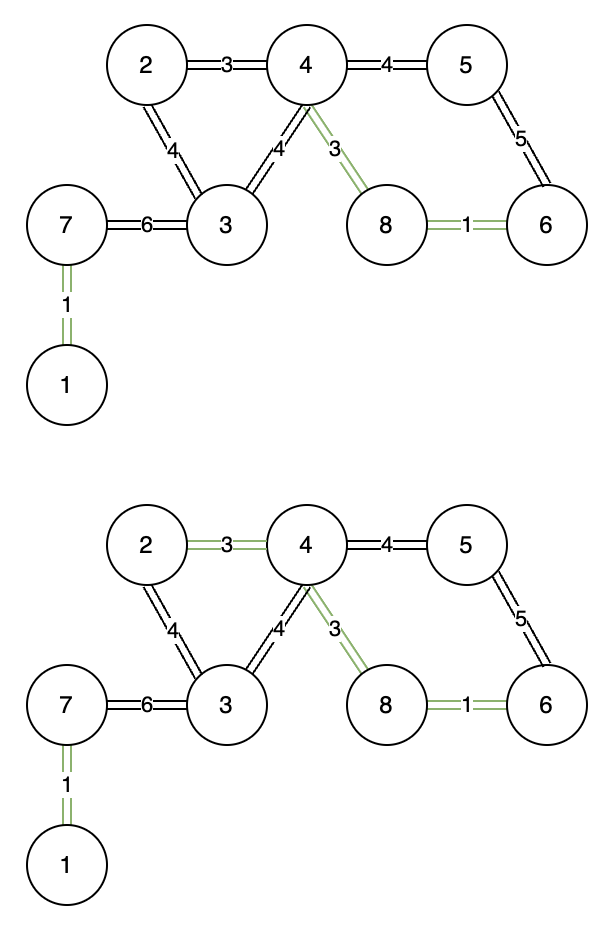
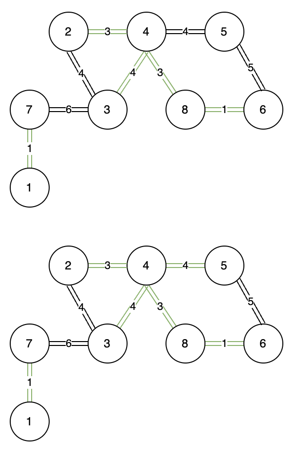
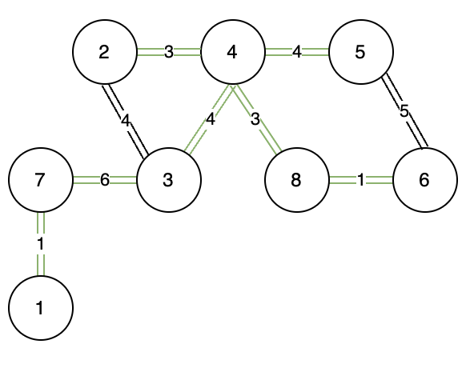

# Minimum Spanning Tree

## Background

A Minimum Spanning Tree (MST) algorithm is a method used in graph theory to find a subset of edges in a connected, edge-weighted graph. This subset forms a tree that includes every vertex of the graph, and the total weight of all the edges in the tree is minimized. The concept of a minimum spanning tree is significant in various fields, such as network design, where it can be used to minimize the cost of connecting all points in a network.


Here are some of the key applications of MST:
1. **Urban and Transportation Planning**: MSTs can assist in optimizing road layouts, ensuring that all necessary areas are connected with the shortest possible total road length, reducing construction and maintenance costs.
2. **Computer Network Routing Protocols**: Some routing protocols used in computer networks, like the Link-State Routing Protocol, use MSTs to determine the most efficient routing path.
3. **Forestry Management**: In forestry, MSTs can help in planning roads to access various forest locations with minimal environmental impact.

## Algroithm

There are several algorithms to find a minimum spanning tree, but two of the most well-known are Kruskal's Algorithm and Prim's Algorithm. Here's a general description of how MST algorithms typically work:

**Initialize**: Start with a graph consisting of vertices and weighted edges. In the beginning, the MST contains no edges.

**Edge Selection**: At each step, select an edge that has the lowest weight and does not form a cycle is added to the MST.

**Adding the Edge**: If the edge is safe to add (i.e., it doesn't form a cycle), include it in the MST.

**Repeat**: Continue the process until the MST has  V − 1 edges, where V is the number of vertices in the graph.

<center>
    
</center>   


<center>
    
</center>   
<center>
    
</center>   

<center>
    
</center>   

## Implementation

The hard point here is how to detect cycle and how to find the minimum weight.

Assume we have graph has structed like below:

```python
N = 10  # number of vertex in graph
M = 20
graph = []

for i in range (M):
    a, b, weight = map(int, input().split())
    edge = list(map(int, input().split()))
    graph.append(edge)
```

```python

def root(parent, i):
    if parent[i] == i:
        return i
    return root(parent, parent[i])

def union(parent, rank, x, y):
    # Find the roots of the sets that x and y belong to.
    xroot = root(parent, x)
    yroot = root(parent, y)

    # Attach the smaller tree under the root of the bigger tree.
    # This is the "union by rank" optimization.
    if rank[xroot] < rank[yroot]:
        parent[xroot] = yroot
    elif rank[xroot] > rank[yroot]:
        parent[yroot] = xroot
    else:
        parent[yroot] = xroot
        rank[xroot] += 1

def MST(N, graph, d):
    # Sort the edges by weight
    sorted_graph = sorted(graph, key=lambda x: x[2])

    parent = {}
    rank = {}

    for edge in sorted_graph:
        v1, v2, _ = edge
        if v1 not in parent:
            parent[v1], rank[v1] = v1, 0
        if v2 not in parent:
            parent[v2], rank[v2] = v2, 0

    for edge in sorted_graph:
        v1, v2, _ = pipe
        v1_root = root(parent, v1)
        v2_root = root(parent, v2)

        if v1_root != v2_root:
            union(parent, rank, v1_root, v2_root)
            # we need this edge 
        else:
            # we do not need this edge (there is a cycle)
```


