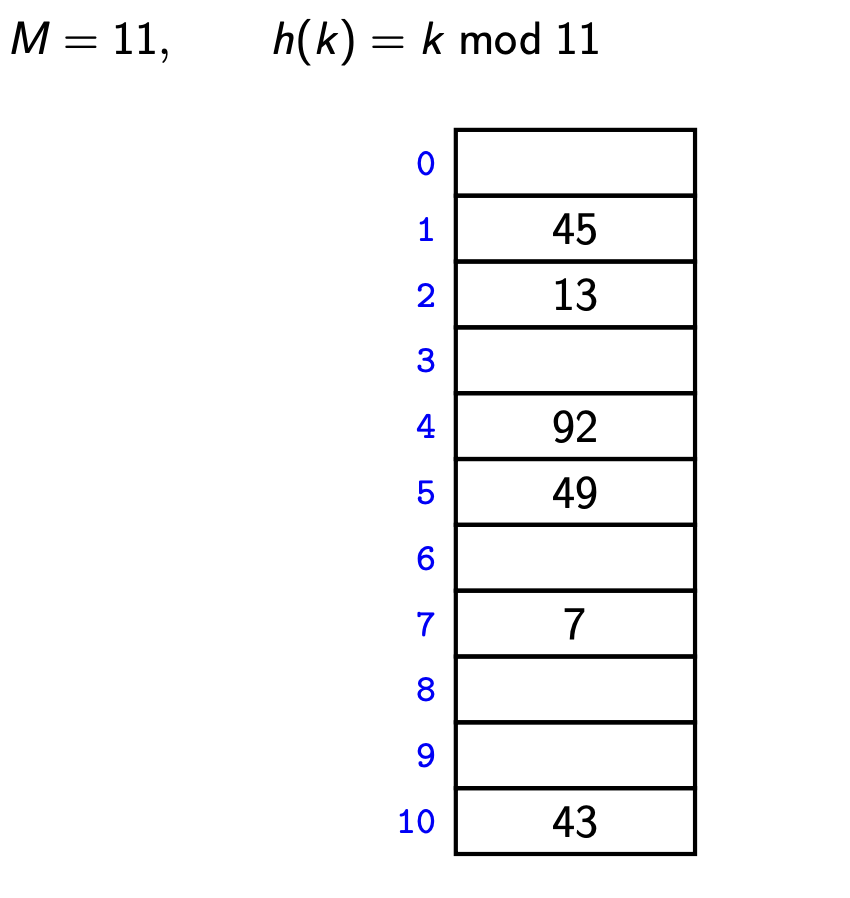
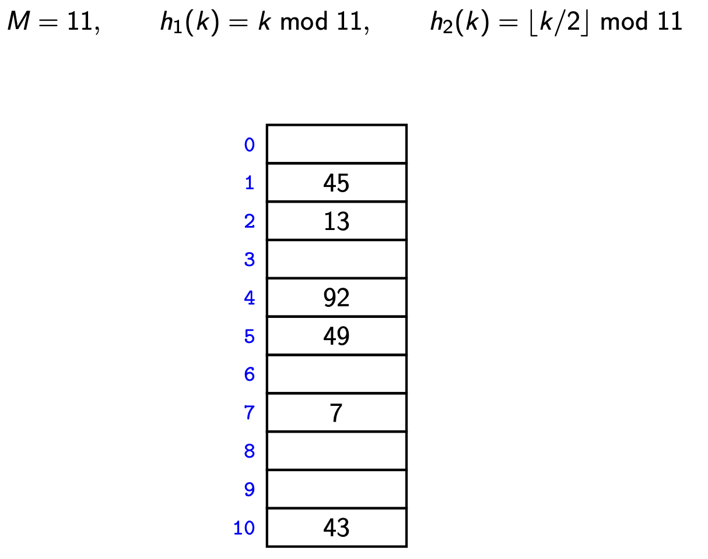

# Hashing
Hashing is a technique that is used to uniquely identify a specific object from a group of similar objects. Some uses of hashing are in database indexing, caching data, password verification, and more.

At the heart of hashing is the hash function. The hash function is used to convert a given key into another value. The hashed value is used as the index for storing the data associated with the input key.

The ideal hash function distributes the keys uniformly across the hash table, avoiding collisions as much as possible.

# Collision Resolution Techniques
Collisions occur when the hash function generates the same hashed value for two or more keys. There are several techniques to handle collisions:

## Chaining
In chaining, each slot of the hash table is a bucket that stores multiple key-value pairs. When a collision occurs (i.e., two different keys hash to the same slot), the key-value pairs are stored in the same bucket. The bucket can be implemented as a linked list, a binary search tree, or another data structure.

***Example:***



```python
class HashTable:
    def __init__(self):
        self.size = 10
        self.table = [[] for _ in range(self.size)]

    def hash_function(self, key):
        return key % self.size

    def insert(self, key, value):
        hash_index = self.hash_function(key)
        for pair in self.table[hash_index]:
            if pair[0] == key:
                pair[1] = value
                return
        self.table[hash_index].append([key, value])
```

**Complexity of chaining:**
- searching
- insert
- delete

## Linear Probing

In linear probing, when a collision occurs, the hash table checks the next slot to see if it is empty. If so, it stores the key-value pair in that slot. If not, it continues to check the next slot until it finds an empty slot.


```python
class HashTable:
    def __init__(self):
        self.size = 10
        self.keys = [None] * self.size
        self.values = [None] * self.size

    def hash_function(self, key):
        return key % self.size

    def insert(self, key, value):
        index = self.hash_function(key)
        while self.keys[index] is not None:
            if self.keys[index] == key:
                self.values[index] = value
                return
            index = (index + 1) % self.size
        self.keys[index] = key
        self.values[index] = value

```

**Complexity of Linear Probing:**
- searching
- insert
- delete


## Double Hashing
Double hashing is another form of open addressing that uses a second hash function to determine the step size for probing. When a collision occurs, instead of checking the next slot (as in linear probing), it checks the slot after a number of positions given by the second hash function.



```python
class HashTable:
    def __init__(self):
        self.size = 10
        self.keys = [None] * self.size
        self.values = [None] * self.size

    def hash_function(self, key):
        return key % self.size

    def rehash(self, oldhash):
        return (oldhash + 1) % self.size

    def insert(self, key, value):
        index = self.hash_function(key)
        while self.keys[index] is not None:
            if self.keys[index] == key:
                self.values[index] = value
                return
            index = self.rehash(index)
        self.keys[index] = key
        self.values[index] = value

```

**Complexity of Double Hashing:**
- searching
- insert
- delete

